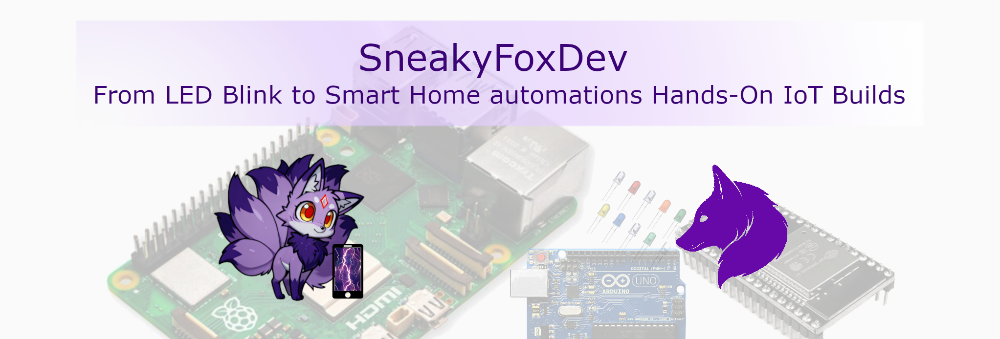

# Fern Station

Fern Station is a structured embedded systems build series using ESP32.

This repository accompanies this SneakyFoxDev YouTube series and contains:
- Full firmware per episode
- Wiring documentation
- Bill of materials
- Engineering explanations

The project evolves incrementally. Each episode adds a new architectural layer.

---

## 🔥 Latest Episode

### Episode 02 — Button Control

In this episode we add a button and an LED controlled by it. This is the first step towards interacting with the system

🎬 Watch on [YouTube](https://youtu.be/quboO_ei0jU).  
📁 Code & Wiring: [Episode 02](episodes/ep02-button_control)

---

## 📚 Episode Index

| Episode | Title | Status |
|----------|--------|---------|
| 01 | LED Heartbeat            | ✅ Released |
| 02 | Button Control             | ✅ Released |  
| 03 | Debounce Logic and Modes | ⏳ Planned |  
| 04 | Button struct            | ⏳ Planned |  
|    | More to come... | |
---

## 🧠 Project Philosophy

Fern Station is a progressively engineered embedded system for plant monitoring.

Concepts introduced:
- Non-blocking timing
- Modular firmware structure
- Hardware abstraction
- Clean pin mapping
- Scalable architecture

---

## 🛠 Hardware Platform

Primary board:
- ESP32-WROOM-32 Dev Module

Toolchain:
- Arduino IDE (primary)

---

## 📦 Full Project BOM (High Level)

- [ESP32 Dev Board](https://amzn.to/3MNZOFy)
- [Breadboard and Jumper Wires](https://amzn.to/4rjHmUh)
- [5mm LED](https://amzn.to/3OOnLwV)
- [220Ω resistor](https://amzn.to/4bXv3YY)
- [USB cable](https://amzn.to/4aVS5OW)
- [Button](https://amzn.to/46kvk4H)

(See episode folders for detailed BOM per build step.)

---

## 📜 License

This project is licensed under the MIT License.

---

## ☕ Support the Project

If you’d like to support the development of Fern Station:

- Subscribe on YouTube
- Share the project
- Patreon (coming soon)

---

## Affiliate Disclosure

This project includes affiliate links.  
They help support development at no extra cost to you.